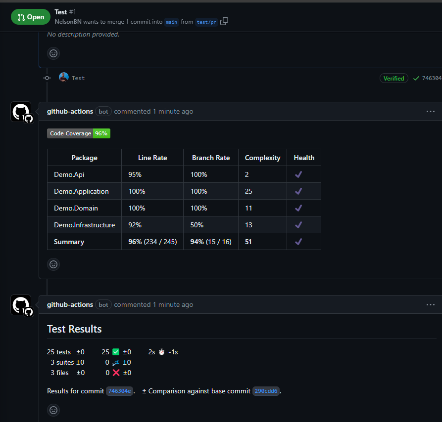
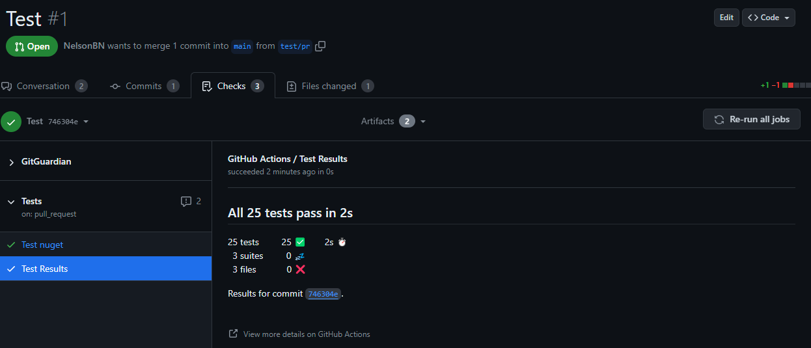
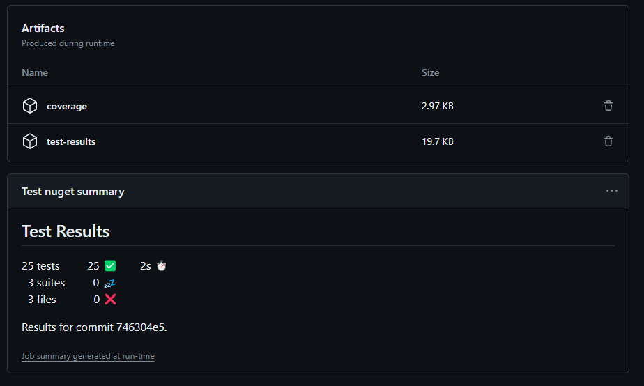

# .NET - Demo GitHub Actions with Test Report

## Examples

### PR

### Test Results

### Test Results

## References

- [Original Blog Post](https://seankilleen.com/2024/03/beautiful-net-test-reports-using-github-actions/?utm_content=287619614&utm_medium=social&utm_source=linkedin&hss_channel=lcp-18055275)

- [Original GitHub Action](https://github.com/SeanKilleen/ExampleTestResultsWithGithubActions/blob/main/.github/workflows/build.yaml)
